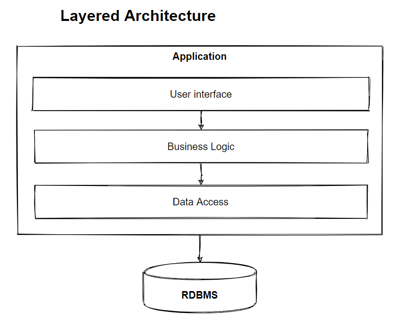
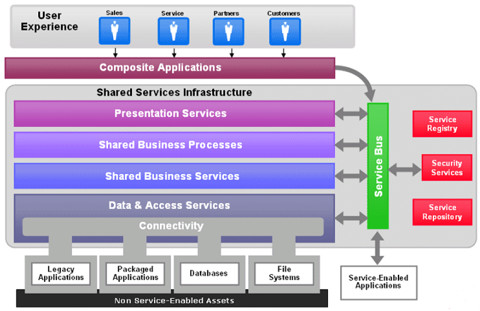
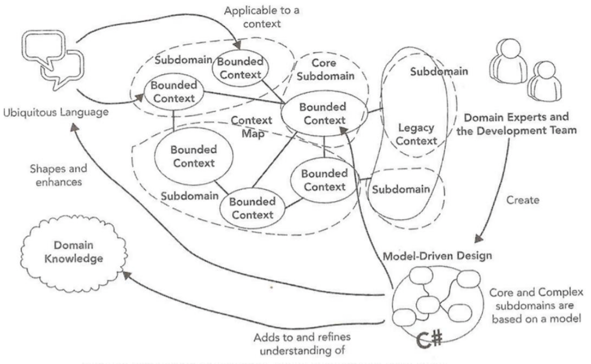
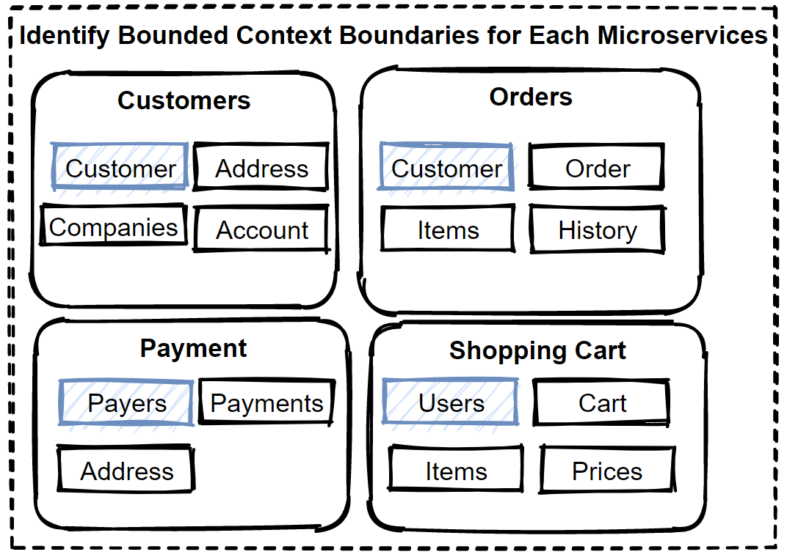
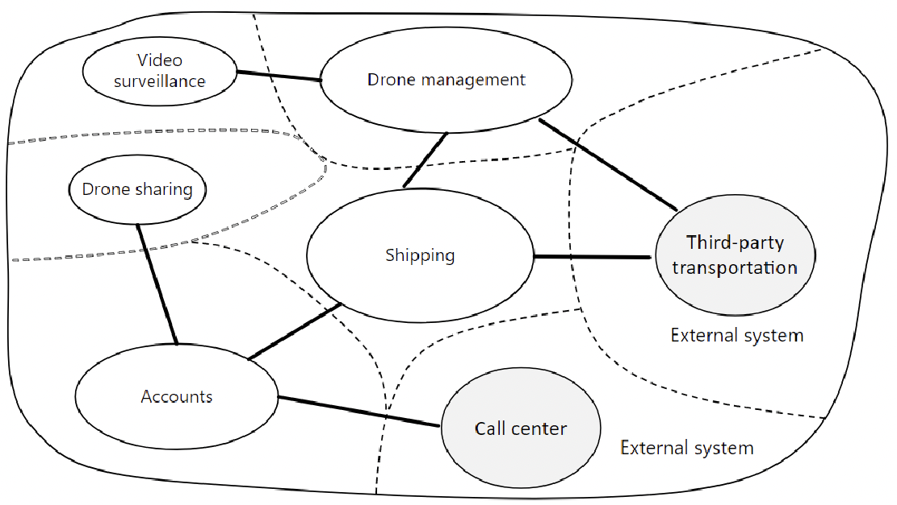

<details>
  <summary>Table of Contents</summary>
  <ol>
    <li><a href="#about-the-project">About The Project</a></li>
    <li><a href="#introduction">Introduction</a>
      <ol>
        <li><a href="#course-target">Course Target</a></li>
        <li><a href="#use-cases---e-commerce-domain">Use Cases - E-Commerce Domain</a></li>
      </ol>
    </li>
    <li><a href="#monolithic-architecture">Monolithic Architecture</a>
      <ol>
        <li><a href="#scalability">Scalability</a></li>
        <li><a href="#deployments">Deployments</a></li>
      </ol>
    </li>
    <li><a href="#layered-n-layer-architecture">Layered (N-Layer) Architecture</a></li>
    <li><a href="#service-oriented-architecture">Service-Oriented Architecture</a></li>
    <li><a href="#microservices-architecture">Microservices Architecture</a>
      <ol>
        <li><a href="#decomposition">Decomposition</a></li>
        <li><a href="#communications">Communications</a></li>
        <li><a href="#api-gateways">API Gateways</a></li>
        <li><a href="#backends-for-frontends-pattern-bff">Backends for Frontends Pattern (BFF)</a></li>
        <li><a href="#asynchronous-message-based-communication">Asynchronous Message-Based Communication</a></li>
        <li><a href="#kafka-architecture">Kafka Architecture</a></li>
        <li><a href="#rabbitmq-architecture">RabbitMQ Architecture</a></li>
        <li><a href="#scaling">Scaling</a></li>
        <li><a href="#data-management">Data Management</a></li>
        <li><a href="#data-management-queries">Data Management Queries</a></li>
      </ol>
    </li>
</details>

&nbsp;

## About The Project

- Design Microservices Architecture with Patterns & Principles
- Handle millions of request with designing high scalable and high available systems on microservices architecture.
- [Mehmet Ozkaya](https://github.com/mehmetozkaya)

&nbsp;

## Introduction

- [Medium - Monolithic to Microservices Architecture with Patterns & Best Practices](https://medium.com/design-microservices-architecture-with-patterns/monolithic-to-microservices-architecture-with-patterns-best-practices-a768272797b2)


### Course Target

- Hands-on Design Activities
- Iterate Design Architecture from On-Premises to Cloud Serverless
- Evolves architecture Monolithic to Event-driven Microservices
- Refactoring System Design for handling million of requests
- Apply best practices with mcroservices design patterns and principles
- Examine microservices patterns with all aspects like Communications, Data Management, Caching and Deployments
- Prepare for Software Architecture Interviews
- Prepare for System Design Architecture Interview exams

&nbsp;


- <b>Subcomponents of Architectures</b>
  - MS Communications (Sync/ Async)
  - MS Data Management (Database/ Query/ Commands)
  - MS Design Patterns & Principles
  - MS Caching
  - MS Deployment


- <b>Evolve Architecture</b>
  - How can we scale the application?
  - How many request that we need to handle in our application?
  - How many second Latency is acceptable for our arch?

### Use Cases - E-Commerce Domain

- Functional Requirements
  - List products
  - Filter products as per brand and categories
  - Put products into the shopping cart
  - Apply coupon for discounts and see the total cost all for all of the items in shopping cart
  - Checkout the shopping cart and create an order
  - List my old orders and order items history
- User Stories
  - As a user I want to list products
  - As a user I want to filter products as per brand and categories
  - As a user I want to put products into the shopping cart so that I can check out quickly later
  - As a user I want to apply coupon for discounts and see the total cost all for all of the items that are in my cart
  - As a user I want to checkout the shopping cart and create an order
  - As a user I want to list my old orders and order items history
  - As a user I want to login the system as a user and the system should remember my shopping cart items
- Non-Functional Requirements
  - Scalability
  - Availability
  - Reliability
  - Maintability
  - Usability
  - Eficiency
- Request per Second and Acceptable Latency

| Concurrent Users | Requests/second | Latency (Expected) |
| :--------------: | :-------------: | :----------------: |
|        2K        |      0.5K       |                    |
|       20K        |       12K       |                    |
|       100K       |       80K       |      <= 2 Sec      |
|       500K       |      300K       |         ?          |

&nbsp;

---

&nbsp;

## Monolithic Architecture

- User Interface -> Business Logic -> Data Access -> DB
- Challenges
  - Single codebase
  - Big deployment
    - Complicated to understanding
  - Single jar/war file
  - Difficult to manage
    - Making New changes
    - Scalability
  - Hard to implement new features
    - New technology barriers
- Benefits for small application
  - Build (Simple to develop)
  - Test (Easier debugging and testing)
  - Simple to Deploy
  - Troubleshoot
  - Scale vertically (scale up)


- Simply to:
  - develop
  - deploy
  - scale


&nbsp;


&nbsp;


- <b>Design principles</b>
  - <b>DRY:</b> Don’t Repeat Yourself
  - <b>KISS:</b> Keep It Simple, Stupid
  - <b>YAGNI:</b> You Ain’t Gonna Need It
- Communication
  - Inter-Process Communication (Transaction Management)
    - Single database of the whole application
    - Simply commit and rollback operations

```
function place_order()
  do_payment
  decrease_stock
  send_shipment
  generate_bill
  update_order
```

- Same server with all modules
- Processes to communicate with each other by method calls into the code

### Scalability

- [Webairy - horizontal and vertical scaling](https://www.webairy.com/horizontal-and-vertical-scaling/)
- The number of requests an application can handle
- To prevent downtime, and reduce latency, you must scale
- <b>Vertical Scaling</b>
  - Vertical scaling by adding more power
  - Makes the nodes stronger
  - Adding more computing power
  - Same code on machines with better specs
  - Adding additional CPU, RAM, and DISK
  - Increase power since to hardware limitations when you reach the maximum capacity
- <b>Horizontal scaling</b>
  - Horizontal scaling by adding more machines
  - Splitting the load between different servers
  - Adds more instances of machines
  - Share the processing power
  - Gives you scalability but also reliability
  - Stateful or Stateless
  - CAP Theorem


- Load Balancer
  - Balance the traffic
  - Spread the traffic across a cluster
  - Consistent hashing algorithms

### Deployments

- Single code base
- Affects the whole system
- Not reliable
- Expensive and risky


&nbsp;

---

&nbsp;

## Layered (N-Layer) Architecture

- [Medium - Layered (N-Layer) Architecture](https://medium.com/design-microservices-architecture-with-patterns/layered-n-layer-architecture-e15ffdb7fa42)
- Presentation tier, for example, a web app.
- Business tier, including use case implementations
- A data tier, such as a SQL database.



- <b>Design principles</b>
  - <b>Separation of Concerns (SoC)</b>
    - Elements in the software should be unique
    - Separate responsibilities
    - Limits to allocate Responsibilities
    - Low-coupling, high-cohesion
  - [<b>SOLID</b>](https://medium.com/bgl-tech/what-are-the-solid-design-principles-c61feff33685)
    - Single Responsibility Principle
    - Open-Closed Principle
    - Liskov Substitution Principle
    - Interface Segregation Principle
    - Dependency Inversion Principle

&nbsp;

---

&nbsp;

## Service-Oriented Architecture

- [Medium - Service-Oriented Architecture](https://medium.com/design-microservices-architecture-with-patterns/service-oriented-architecture-1e4716fbca17)
- [DBizInstitute - The Four Tenets of Service Orientation](https://www.dbizinstitute.org/resources/articles/four-tenets-service-orientation)
- [HubPages - SOA design patterns Managers, Engines and Gateways](https://discover.hubpages.com/technology/SOA-Design-Pattern-WCF)
- [HubPages - Service Orientated Architecture (SOA\WCF) explained and defined for Executives](https://discover.hubpages.com/technology/soa-with-wcf)
- [Oracle - Service-Oriented Architecture](https://docs.oracle.com/cd/E13171_01/alsb/docs30/concepts/introduction.html)
- Service components
- Communicates over the network
- Converged service Infrastructure
- Enterprise applications



- <b>Enterprise Service Bus (ESB)</b>
  - Integrations between applications
  - Transformations of data models
  - Middleware messaging components
  - Service orchestration
  - Increased complexity and introduced bottlenecks
- <b>Communication</b>
  - Enterprise service bus - ESB systems.
  - Handles connectivity and messaging, performs routing
  - Inter-service communication
  - SOAP-based web services
  - SOAP, WSDL, and XSD


- <b>Comparing SOA and Microservices</b>
  - Inter-service communication due to distributed services
    - SOA uses Enterprise Service Bus
    - Microservices uses message brokers
  - Size of the services different
    - SOA is typically use for integrating large, complex, monolithic applications
    - All the services in Microservices are almost always much smaller
  - ESB middleware expensive

&nbsp;

---

&nbsp;

## Microservices Architecture

- [Medium - Microservices Architecture](https://medium.com/design-microservices-architecture-with-patterns/microservices-architecture-2bec9da7d42a)
- [microservices.io](https://microservices.io/)
- <b>What are Microservices?</b>
  - Small services
  - Running in its own process
  - Communicating with APIs
  - Independently deployable
  - Different programming languages
  - Own technology stack
  - Decouple microservices with bounded context


- [<b>Characteristics</b>](https://martinfowler.com/articles/microservices.html)
  - Componentization via Services
  - Organized by Business Capabilities
  - Products not Projects
  - Smart endpoints and dumb pipes
  - Decentralized Governance
  - Decentralized Data Management
  - Infrastructure Automation
  - Design for failure
- <b>Benefits</b>
  - Agility
  - Small, focused teams
  - Small and separated code base
  - Right tool for the job
  - Adapting Technology changes
  - Fault isolation
  - Scalability
  - Data isolation
- <b>Challenges</b>
  - Complexity
  - Network problems and Latency
  - Development and testing
  - Data integrity
- <b>Pros & Cons</b>
  - Independent Services
  - Better scalability
  - Technology Diversity
  - Agility
  - Small, focused teams
  - Challenge of management and traceability


&nbsp;


- <b>The Database-per-Service Pattern</b>
  - Loose coupling of services
  - Own databases
  - Polygot persistence
  - Can’t be accessed directly
  - Scale independently
  - Data encapsulated within the service
  - Not affect to other services


&nbsp;

- [Future Fundamentals - What is Microservices Architecture?](https://www.futurefundamentals.com/what-is-microservices-architecture/)
- [Feras' Blog - Microservices Architecture: To Be Or Not To Be](https://feras.blog/microservices-architecture-to-be-or-not-to-be/)
- [Microsoft - Introducing eShopOnContainers reference app](https://docs.microsoft.com/en-us/dotnet/architecture/cloud-native/introduce-eshoponcontainers-reference-app)


&nbsp;


&nbsp;


&nbsp;


&nbsp;

---

&nbsp;

### Decomposition

- Understand E-Commerce Domain -> Decomposition Microservices Architecture and Identify Microservices
- E-Commerce Domain Analysis -> Bounded Contexts -> Decompose Strategies -> Identify Microservice Boundaries
- [Medium - Decomposition of Microservices Architecture](https://medium.com/design-microservices-architecture-with-patterns/decomposition-of-microservices-architecture-c8e8cec453e)
- <b>Decompose by Business Capability</b>
  - Services must be Cohesive
  - Services must be Loosely Coupled
  - Corresponding to Business Capabilities
    - Product catalog
    - Inventory
    - Order
    - Delivery
  - Business Capability
- <b>Decompose by Subdomain</b>
  - Services must be Cohesive
  - Services must be Loosely Coupled
  - Domain-Driven Design (DDD) Subdomains
    - Product catalog
    - Inventory
    - Order
    - Delivery
  - The business - as the domain
- [<b>Bounded Context Pattern (Domain-Driven Design - DDD)</b>](https://www.martinfowler.com/bliki/BoundedContext.html)
  - DDD-Bounded Context
  - Domains are required high cooperation
  - Strategic and Tactical DDD
  - Grouping of closely related Scopes
  - Logical boundaries have common business rules


- DDD deals with large models by dividing them into different Bonded Contexts and being explicit about their interrelationships.
- <b>Identify Bounded Context Boundaries for Each Microservices</b>
  - DDD-Bounded Context
  - Context Mapping pattern
  - Context Mapping
  - Define logical boundaries between domains



- Talking to the domain experts
- Changes to the boundaries
- Reshape your Bounded Contexts
- Consider Refactorings
- A Bounded Context == A Microservice ?



- <b>Domain Analysis to Model Microservices</b>
  - Domain Analysis
  - Designed by business capabilities
  - Loose coupling and autonomous services
  - DDD-Bounded Context following Context Mapping Pattern and decompose by sub domain models patterns



- <b>Understand E-Commerce Domain</b>
- [Build Layered Architecture with ASP.NET Core, Entity Framework Core in a Real-Word Example](https://medium.com/aspnetrun/build-layered-architecture-with-asp-net-core-entity-framework-core-in-a-real-word-example-aa54a7ed7bef)
- Use Cases
- Functional Requirements
  - List products
  - Filter products as per brand and categories
  - Put products into the shopping cart
  - Apply coupon for discounts and see the total cost all for all of the items in shopping cart
  - Checkout the shopping cart and create an order
  - List my old orders and order items history
- Steps:
  - Requirements and Modelling
  - Identify User Stories
  - Identify the Nouns in the user stories
  - Identify the Verbs in the user stories
- Analysis E-Commerce Domain - Nouns and Verbs
  - As a user I want to list products
  - As a user I want to be able to filter products as per brand and categories
  - As a user I want to see the supplier of product in the product detail screen with all characteristics of product
  - As a user I want to be able to put products that I want to purchase in to the shopping cart so that I can check out quickly later on
  - As a user I want to see the total cost all for all of the items that are in my cart so that I see if I can afford to buy everything
  - As a user I want to see the total cost of each item in the shopping cart so that I can re-check the price for items
  - As a user I want to be able to specify the address of where all of the products are going to be sent to
  - As a user I want to be able to add a note to the delivery address so that I can provide special instructions to the postman
  - As a user I want to be able to specify my credit card information during check out so that I can pay for the items
  - As a user I want system to tell me how many items are in stock so that I know how many items I can purchase
  - As a user I want to receive order confirmation email with order number so that I have proof of purchase
  - As a user I want to list my old orders and order items history
  - As a user I want to login the system as a user and the system should remember my shopping cart items


&nbsp;


|     Sync Case - Add to backet     | Async Case - Place Order |
| :-------------------------------: | :----------------------: |
| Get latest discount from discount |       order placed       |
|            Add basket             |       get payment        |
|                                   |      decrease stock      |
|                                   |      send shipment       |
|                                   |      generate bill       |
|                                   |    update order table    |

&nbsp;

---

&nbsp;

> <b>Robert: </b>Just want to mention this is a great course. I'll have specific questions later but it turns out I've been doing much of this using the Strangler pattern. I have a legacy .net web forms app that is in AWS, still monolithic and using Strangler to get it to microservices. If you have any good resources on Strangler, I'd appreciate a link. Just to make sure I'm heading correctly.

> <b>Mehmet: </b>Thanks for great message.
>
> Unfortunately I have no specific resource for Strangler pattern. But I know that you should revised your system step by step and carefully. First of all you should start to move with non-functional operations like monitoring, logging, etc.. those are not affected your business logics.
>
> After that you should follow periphery business logics to move one by one with splitting microservices.
>
> Its not that easy to follow but the way should be always secure actual operation all time.

&nbsp;

---

&nbsp;

### Communications

- [Medium - Microservices Communications](https://medium.com/design-microservices-architecture-with-patterns/microservices-communications-f319f8d76b71)
- Monolithic = Inter-Process
- Microservices = Inter-Service communication
- Distributed network calls
- HTTP, gRPC or message brokers AMQP protocol
- Synchronous or Asynchronous


&nbsp;


- <b>Synchronous Communication</b>
  - Inter-Service communication
  - Distributed network calls
  - HTTP, gRPC protocols
  - Synchronous Request/Response
  - REST APIs
- <b>Asynchronous Communication</b>
  - Not wait Response and not have blocked a thread
  - AMQP (Advanced Message QueuingProtocol)
  - one-to-one(queue)
  - one-to-many (topic)
  - publish/subscribe
  - Event-driven microservices architecture
- <b>Microservices Synchronous Communication and Practices</b>
  - Not wait Response and not have blocked a thread
  - AMQP (Advanced Message QueuingProtocol)
  - one-to-one(queue)
  - one-to-many (topic)
  - publish/subscribe
  - Event-driven microservices architecture


- Designing HTTP based RESTful APIs for Microservices
  - REST APIs for HTTP verbs like GET, POST, and PUT
  - Creating APIs for our microservices
  - Design Microservice APIs
  - Avoid chatty calls
  - Public APIs
  - Backend APIs
  - REST vs gRPC protocols


&nbsp;

---

&nbsp;

> <b>Abdus Salam: </b>What is better for service to service communication? GRPC or RabbitMQ?
> What will be a good approach if I want a request/response between two services? HTTP, GRPC or RabbitMQ call. Like I am doing a service call in a line of code. On the following line, I need the response of the previously called method. Please consider both scenarios, when I need a response and also when I don't need a response.

> <b>Mehmet: </b>Here my decision tree for that requirements:
>
> 1- Need Response ? - NO
>
> Then choose async communication with message brokers like rabbitmq. Implement pub/sub pattern.
>
> 2- Need Response ? - YES
>
> 2.1 - Is customer face api ? (like frontend to api gateway and need to see payload explicitly) - YES
>
> Then choose HTTP REST API.
>
> 2.2 - Communication between only backend microservices - and need to performant ? - YES
>
> Then choose GRPC.

&nbsp;

---

&nbsp;

- <b>RESTful API design</b>
  - Request/Response communication
  - REST HTTP protocol, and implementing HTTP verbs like GET, POST, and PUT.
  - REST (Representational State Transfer)
  - Stateless
  - Uniform Interface
  - Cacheable
  - Client-Server
  - Layered System
  - Code on Demand


- <b>What is RESTful APIs?</b>
  - HTTP protocol with HTTP methods (GET, POST, PUT, DELETE)
  - Richardson Maturity Model
  - Level 0: Define one URI
  - Level 1: Create separate URIs
  - Level 2: Use HTTP methods
  - Level 3: Use hypermedia


- <b>API versioning</b>
  - API changes may break some communications
  - Deploy your services - required to add new features or bug fixes
  - Backward compatible and not break any communications
  - Best practice for the roll-out or canary deployments on Kubernetes


- <b>What is gRPC?</b>
  - gRPC (gRPC Remote Procedure Calls)
  - HTTP/2 protocol to transport binary messages
  - Protocol Buffers, also known as Protobuf files
  - Cross-platform client and server bindings
- <b>How gRPC works?</b>
  - gRPC directly call a method on a server
  - Build distributed applications and services
  - Defining a service that specifies methods that can be called remotely
  - Can be written in any language that gRPC supports


- <b>Advantages of gRPC</b>
  - Using HTTP / 2
  - Binary serialization
  - Supporting a wide audience with multi-language / platform support
  - Open Source and the powerful community behind it
  - Supports Bi-directional Streaming operations


&nbsp;

---

&nbsp;

> <b>Daniel: </b>Is gRPC better than REST?
>
> bout "single source of truth" and "handle non-breaking changes", I think you consider the use of protobuffer to ensure these capabilities. And this is a good point of gRPC over REST because the first use a contract like SOAP, as you say in the lesson, and REST is more flexible or less "formal" because it hasn't a contract.
>
> But I don't understand because REST don't is multiplatform? Which modern languages don't talk REST? Or what's the difference in tracing, logging, and monitoring if both (REST and gRPC) need plugins for these capabilities. In this way shown here, seem REST is more poor wich gRPC, but I think of which not. Excuse me, but I don't understood your point of view.

> <b>Mehmet: </b>But I don't understand because REST don't is multiplatform? Which modern languages don't talk REST?
>
> REST of course multiplatform that I don't need to mention this for REST because of it using JSON payloads. JSON is generic handshake for any languages. No gRPC is not so advantage from REST. If it was, than most of enterprise applications swap communication REST to gRPC.
>
> gRPC is better than REST in terms of performant point. It is comparatively fast from REST communication. But it has some drawbacks and the main drawback is can't see payload explicitly due to byte conventions. So if you need to follow gRPC payloads with communications, its harder than REST apis. Thats why still REST is mostly using in the software industry, so gRPC is starting to use if the communication is need performance.
>
> Let me say best practices for these communication types, SPA, or any client to server communications held with REST apis. For example Client - Api Gw communications are always rest apis.
>
> When you need sync backend microservice communication then it can use gRPC for performant and decrease latency. Its not so common because most backend communications try to decouple services with async communications like event bus. So that's why gRPC is not common like REST apis. I hope I can explain it.

&nbsp;

---

&nbsp;

- <b>gRPC usage of Microservices Communication</b>
  - Synchronous backend microservice-to-microservice communication
  - Polyglot environments
  - Low latency and high throughput communication
  - Point-to-point real-time communication
  - Network constrained environments


&nbsp;


&nbsp;

---

&nbsp;

### API Gateways

- [Kong - What is an API Gateway?](https://konghq.com/learning-center/api-gateway/what-is-an-api-gateway)
- <b>Drawbacks of the direct client-to-microservices communication</b>
  - Direct client-to-microservice communication problems
  - Expose fine-grained endpoints
  - Client try to handle multiple calls
  - Chatty communications
  - Increases latency and Complexity on the UI side
- <b>API Gateways</b>
  - API gateway pattern
  - Cross-cutting concerns
  - Routing to internal microservices
  - Aggregate several microservice


- <b>Gateway Routing pattern</b>
  - Route requests to multiple microservices
  - Exposing a single endpoint
  - Layer 7 routing
  - Protocol Abstraction
  - Centralized Error Management


- <b>Gateway Aggregation pattern</b>
  - Aggregate multiple internal requests
  - Different backend microservices
  - Manage direct access services
  - Reduce chattiness communication
  - Dispatches requests


- <b>Gateway Offloading pattern</b>
  - Complex large microservices-based applications
  - Facade pattern
  - Reverse proxy or gateway routing
  - Routing requests from clients to backend services
  - Single-point-of-failure risk

|                 Ocelot                 |               Features               |
| :------------------------------------: | :----------------------------------: |
|                Routing                 |            Authentication            |
|          Request Aggregation           |            Authorization             |
| Service Discovery with Consul & Eureka |              Throtting               |
|             Load Balancing             |          Logging & Tracing           |
|        Correlation Pass-Through        | Headers/ Query String Transformation |
|           Quality of Service           |          Custom Middleware           |

&nbsp;

---

&nbsp;

> <b>Robert: </b>API Gateway aggregation and offloading
>
> I understand the API Gateway routing. This is pretty standard. But how is aggregation and offloading done in the API Gateway. To me, aggregation would occur in a microservice. Using AWS API Gateway as an example, how is aggregation done? Is it a special endpoint?

> <b>Mehmet: </b>Offloading is feature in api gateways that we can configure on console or via development. For example in AWS Api Gateway has offloading configurations. But gateway aggregation is not included feature for most of the api gateways. As you said, it can handle with separate aggregator microservice or handle in api gateway if possible. We had write our own api gateway in my previous project, so we included aggregator services into Api gateway.
>
> Also some cloud-native api gateways can be different solutions;
>
> - [Kong Nation - API aggregation](https://discuss.konghq.com/t/api-aggregation/1322)
>
> - [Envoy - Configuration: Static](https://www.envoyproxy.io/docs/envoy/latest/start/quick-start/configuration-static)

> <b>Daniel: </b>Hi guys, I have similar questions about this. For Offloading gateway, I found [this](https://docs.microsoft.com/en-us/azure/architecture/patterns/gateway-offloading)
>
> About aggregation pattern, I think of coupling between API gateway and microservices and also the logic of use cases need to move to API gateway for orchestration all calls. Somehow the API Gateway will know which microservice to call, which information need to be retrieved, and which sequence of call to everyone microservice. I think which It isn't responsibility of API Gateway to know this. This is correct? If yes, then when use a API Gateway like aggregator?

> <b>Mehmet: </b>Let me give some real-world implementation example here. We had custom api-gateway which written from our team. And we have handle some basic aggregator use cases in api gateway with exposing 1 service and when handling it in api gateway, we have aggregated a few internal microservices into api gateway.
>
> But in some cases, we need more that a few microservices need to aggregate and some complex business rules need to apply for more than 5 microservices. So for that cases we have created separated Aggregator microservices that develop all those logics into that microservices.
>
> The idea is here is not to create bottleneck for any microservices. If we put those complex logic into api gateway, it will be the bottleneck and hard to scale hard to manage it.
>
> So there is not clear recommendation here, you can choose your way according to your business requirements.

&nbsp;

---

&nbsp;

### Backends for Frontends Pattern (BFF)

- [Medium - Backends for Frontends Pattern — BFF](https://medium.com/design-microservices-architecture-with-patterns/backends-for-frontends-pattern-bff-7ccd9182c6a1)
- Separate api gateways
- API Gateway for handling to routing and aggregate operations
- Grouping the client applications
- Avoid bottleneck of 1 API Gw
- Several api gateways as per user interfaces


- <b>Communications between Backend Internal Microservices</b>
  - Sync request comes from the clients
  - Client requests are required to visit more than one internal microservices
  - Reducing inter-service communication
  - Query request to internal microservices
  - Dependent and coupling service


- <b>Chain Queries</b>
  - Much chain calls
  - Create order use case
  - Request/Response sync Messaging pattern
  - Increase latency and negatively impact the performance


- <b>Service Aggregator Pattern</b>
  - Minimize service-to-service communications
  - Receives a request from api gw
  - Dispatchs requests of multiple internal backend microservices
  - Combines the results

&nbsp;

---

&nbsp;

> <b>Gregor: </b>Hello, as I understand it the Service Aggregator Pattern is used to reduce the network-calls between microservices so the overall latency of a request is reduced. But it doesn't solve the problem of dependend services and a failure if one service is down.
>
> But doesn't the use of an Aggregator Service add additional dependencies/complexity to the overall system? In your example in lecture 77, the "shopping cart"-service accessed the "order"-service, which on its own accessed the "billing"- and "shipping"-service. This leads to more latency, but the "shopping cart"-service would not need to know about the last two services. If we want create a new Aggregator Service, this service needs to know more about other services and their internal workings to successfully aggregate their hidden service calls. I would be interested in your thoughts about that. Thank you!

> <b>Mehmet: </b>yes you are right. If you need lots of aggregator services then you have in wrong situation. The main benefit of aggregator patterns is reduce client calls and client don't manage to collect data different services. But since this calls are sync requests, it would not be collect data so many internal services, this will open to broke resilience and can't respond success messages. Its nature of sync communications. So we should careful about when using these aggregator services. If possible we can convert communication to async way and client retrieve data after a certain time of later.

&nbsp;

---

&nbsp;

> <b>Gregor: </b>Difference between Gateway Aggregation Pattern and Service Aggregator Pattern
>
> hello, could you go into details about the difference between the Gateway Aggregation Pattern and the Service Aggregator Pattern? They seem quite similar. Could you give examples for when to use the aggregator-pattern in the gateway or in a new microservice? Thank you!

> <b>Mehmet: </b>Yes basically its similar approaches which is aggregate some operations.
>
> Gateway part, this aggregation handled by api gateways on microservices architectures. For example you can aggregate customer + orders into api gateway and respond client in 1 response.
>
> Service part, this aggregation handled by separated microservices, like you create CustomerOrders microservice and aggregate customer+orders into that microservices with applying some complex business logics.

&nbsp;

---

&nbsp;

- <b>Service Registry Pattern</b>
  - Microservice Discovery Patterns
  - Register and discover microservices
  - Microservices should register to Service Registry
  - Finds the location of microservice


&nbsp;

---

&nbsp;

> <b>Santiago: </b>Aggregator making requests to Service Registers rather than the API Gateway
>
> In this case, when the API Gateway delegates to the Aggregator the responsibility for requesting data from the services and returning a composite response, shoudn't the role of making requests to the Service Registers fall to the Aggregator rather than the API Gateway?

> <b>Mehmet: </b>Yes it should be. Actually service registers are not in our world anymore, because orchestrators like k8s handle all service level abstraction and api gateways or Aggregators communicate downstream services without worrying about addresses.

&nbsp;

---

&nbsp;

> <b>Prateek: </b>Aggregator registry to the Service Registry?
>
> Does Aggregator also registers itself to Service Registry, so that Gateway can identify it ? And also Aggregator fetches IP and port numbers of the required microservice from the Service Registry?

> <b>Mehmet: </b>Hi, Yes exactly, since Aggregator also a separate microservices, it should register itself. But also it has one more task to get ip addresses and redirect request to downstream microservices.

&nbsp;

---

&nbsp;

### Asynchronous Message-Based Communication

- Not wait Response and not have blocked a thread
- Advanced Message Queuing Protocol (AMQP)
- one-to-one(queue)
- one-to-many (topic)
- publish/subscribe
- Event-driven microservices architecture
- Multiple microservices are required to interact each other
- Without any dependency or make loosely coupled
- Eventual consistency
- Message broker systems
- AMQP protocol
- Kafka and Rabbitmq
- <b>2 Types</b>
  - Single receiver message-based communication one-to-one(queue) model
  - Multi receiver message-based communication one-to-many (topic) model or publich/ subscribe model


- <b>Single-receiver message-based communication</b>
  - One-to-one or point-to-point communications
  - Without any dependency or make loosely coupled
  - Message-based Communication
  - CreateOrder event


- <b>Multi-receiver message-based communication</b>
  - One-to-many or publish/subscribe communications
  - Service publish a message and it consumes from several microservices
  - Event bus interface
  - OrderSubmitted Event
  - Event-driven Architecture, CQRS pattern, event storing, eventual consistency principles


- <b>Dependency Inversion Principles (DIP)</b>

&nbsp;


&nbsp;

---

&nbsp;

### Kafka Architecture

- <b>What is Apache Kafka?</b>
  - Open-source event streaming platforms
  - Horizontally scalable, distributed, and fault-tolerant
  - Distributed publish-subscribe
  - Event-driven Architecture
  - Topic Messages
  - ZooKeeper sync
  - Topics, Partitions, Brokers, Producer, Consumer & Zookeeper
- <b>Benefits</b>
  - Reliability, Scalability, Durability, Performance
  - Built-in partitioning, replication and fault -tolerance
- <b>Use Cases</b>
  - Messaging
  - Metrics
  - Log Aggregation
  - Stream Processing
  - Activity Tracking
  - Event Sourcing


- <b>Topic, Partitions, Offset and Replication Factor</b>


- <b>Kafka Brokers - Kafka Cluster</b>
  - Data replication, fault tolerance, and high availability of your Kafka cluster
  - Multiple brokers to maintain load balance
- <b>Zookeeper</b>
  - Manage and maintenances
  - Coordinating Kafka broker
  - Kafka Cluster master-less architecture
  - Follows the brokers in the cluster
  - Takes care about broker lifecycle


- <b>Core APIs</b>
  - <b>Producers API: </b>Producers push data to brokers
  - <b>Consumer API: </b>Subscribe to topics and process the streams of data
  - <b>Streams API: </b>Transforming the input streams to output streams
  - <b>Connect API: </b>Configure connectors to move data into Kafka or from Kafka


&nbsp;

---

&nbsp;

### RabbitMQ Architecture

- <b>What is RabbitMQ</b>
  - Message Queue System
  - Event-Driven Architecture
  - Apache Kafka, Msmq, Microsoft Azure Service Bus, Kestrel, ActiveMQ


- <b>Main Components</b>


- <b>Queue Properties</b>
  - Name
  - Durable
  - Exclusive
  - AutoDelete


- <b>Exchange Types</b>
  - Direct
  - Topic
  - Fanout
  - Header


&nbsp;


- <b>Architecture</b>
  - Producer can only send messages to an exchange
  - Exchanges control the routing of messages
  - RabbitMQ uses a push model
  - Distribute messages individually and quickly

&nbsp;

---

&nbsp;

### Scaling

- [<b>Scale Cube</b>](https://microservices.io/articles/scalecube.html)
  - <b>X-Axis: </b>Horizontal Duplication and Cloning of services and data
  - <b>Y-Axis: </b>Functional Decomposition and Segmentation - Microservices
  - <b>Z-Axis: </b>Service and Data Partitioning along Customer Boundaries - Shards/Pods


- <b>Stateless and Stateful Application Horizontal Scaling</b>
  - Scalability of our architecture to handle more number of concurrent requests
  - Vertical scaling "scale up" is increase the hardware resources for exiting servers
  - Horizontal Scaling "scaling out" is splitting the load between different servers
  - If the server have a state or not ?
- <b>How to Scale Stateful Application Horizontal?</b>
  - CAP Theorem
  - Consistency level
  - Strict consistency
  - Eventual consistency
  - Spliting database servers
  - Database Sharding

&nbsp;

---

&nbsp;

### Data Management

- [Medium - Microservices Data Management](https://medium.com/design-microservices-architecture-with-patterns/microservices-data-management-3235893b7c29)
- <b>Polyglot Persistence Microservices</b>
  - Data integrity and data consistency
  - Database-per-service its own data
  - Isolating each service's databases
  - Polyglot Persistence principle
  - Duplicated or partitioned data challenge
  - Data consistency problems transaction management
  - Welcome duplicate datas and eventual consistency
  - Accept eventual consistency data
  - Ability to scale independently
  - Avoid single-point-of-failure of bottleneck databases
  - Event driven architecture style


- <b>Database Management Patterns and Principles</b>
  - Should have a strategy
  - The Database-per-Service pattern
  - The API Composition pattern
  - The CQRS pattern
  - The Event Sourcing pattern
  - The Saga pattern
  - The Shared Database anti-pattern
- <b>API Composition patterns</b>
  - Dispatches requests of multiple internal backend microservices
  - API Gateway Pattern
  - Gateway Routing pattern
  - Gateway Aggregation pattern
  - Gateway Offloading pattern


- <b>CQRS pattern</b>
  - Command query responsibility segregation (CQRS)
  - Separate commands and queries database
  - Write-less, read-more approaches


- <b>Event Sourcing pattern</b>
  - Accumulate events
  - Aggregates them into sequence of events
  - Replay at certain point of events


- <b>Saga pattern</b>
  - Provide Transaction management
  - Maintaining data consistency
  - 2 types of SAGA
  - Choreography – when exchanging events happens without points of control
  - Orchestration – when you have centralized controllers


- <b>Shared Database anti-pattern</b>
  - Shared Database
  - Anti-pattern
  - Single shared database with each service accessing data
  - Against to microservices nature
  - Big a few Monolithic applications


- <b>Database-per-Service pattern</b>
  - Shifting to the monolithic architecture to microservices architecture
  - Decomposes database into a distributed data model
  - Evolve rapidly and easy to scale applications
  - Schema changes can perform without any impact
  - Scaling independently


- <b>Polyglot Persistence</b>
  - Different kinds of data storing technologies
  - Come with a cost
  - Looked up page elements by ID inappropriately
  - Better suited to a key-value no-sql databases
  - How to Choose a Database for Microservices ?

&nbsp;

---

&nbsp;

> <b>Abdus Salam: </b>Is it compulsory to use database per service?

> <b>Mehmet: </b>No its not compulsory but its best practice to follow when it comes to designing microservices architectures. Even microservice architectures you can share database servers for different microservices with different connections. So that tutor also right, but as far as I see on enterprise projects, they indented to create database per service. For my experience, I didnt see that kind of usage in microservice projects.

&nbsp;

---

&nbsp;

- <b>Relational Databases</b>
  - Storing data into related data tables
  - Fixed schema and use SQL to manage data
  - Support transactions with ACID
  - Polyglot persistence in microservices
  - Oracle, MS SQL Server, MySQL & PostgreSQL
- <b>No-SQL Database</b>
  - Different types of stored data
  - Ease-of-use, scalability, resilience, and availability
  - Stores unstructured data in key-value pairs or JSON documents
  - Don't provide ACID guarantees
- <b>No-SQL Document Databases</b>
  - Store and query data in JSON-based documents
  - Data and metadata are stored hierarchically
  - Objects are mapping to the application code
  - Scalability, document databases can distributed very well
  - Content management and storing catalogs, MongoDB and Cloudant
- <b>No-SQL Key-Value Databases</b>
  - Data is storing as a collection of key-value pairs
  - Group of key-value in the database
  - Session-oriented applications for example storing customer basket data
  - Redis, Amazon DynamoDB, Oracle & NoSQL Database
- <b>No-SQL Column-Based Databases</b>
  - Wide-Column Databases
  - Data is stored in columns
  - Access necessary data faster
  - Don’t scanning the unnecessary information
  - Scale by columns independently
  - Data warehouse and Big Data processing
  - Apache Cassandra, Apache HBase or Amazon DynamoDB
- <b>No-SQL Graph-Based Databases</b>
  - Stores data in a graph structure
  - Data entities are connected in nodes
  - Navigate graph relationships
  - Fraud detection, social networks, and recommendation engines
  - OrientDB, Neo4j, and Amazon Neptune
- <b>How to Choose a Database for Microservices</b>
  - [Medium - How to Choose a Database for Microservices — CAP Theorem](https://medium.com/design-microservices-architecture-with-patterns/how-to-choose-a-database-for-microservices-cap-theorem-d1585bf40ecd)
  - Key Point 1 - Consider the "consistency level“
  - Do we need Strict Consistency or Eventual Consistency ?
  - Eventual consistency in microservices architecture in order to gain scalability and high availability
  - Key Point 2 - High Scalability - accommodate millions of request
  - Key Point 3 - High Availability - separate data center
  - Before deciding database, we should check the CAP Theorem


- <b>CAP Theorem</b>
  - Found in 1998 by a Professor Eric Brewer
  - Consistency, Availability, and Partition Tolerance cannot all be achieved at the same time
  - Distributed systems should sacrifice between consistency, availability, and partition tolerance
  - Can only guarantee two of the three concepts
  - <b>Consistency, Availability & Partition Tolerance</b>
    - Consistency - get any read request, the data should return last updated value
    - Must block the request until all replicas update
    - Availability - respond to requests at any time
    - fault-tolerance in order to accommodate all requests
    - Partition Tolerance - network partitioning, located in different networks
  - <b>Consistency and Availability at the same time?</b>
    - If Partition Tolerance, either Availability or Consistency should be selected
    - Partition Tolerance is a must for distributed architectures
    - Relational databases prevent distribute data from different nodes, NoSQL databases easily scalable.
    - Microservices architectures choose Partition Tolerance with High Availability and follow Eventual Consistency

&nbsp;

---

&nbsp;

> <b>Robert: </b>Microservice communication
>
> I'm real confused about how one microservice communicates with another. You said it can be done through REST. Can you be more specific. I'm used to API Gatewayrouting to Lambda functions. But the API gateways are exposted to the public. I'm also familiar with node/express running on a server and a front-end accessing that. But if I just have two lambda functions, what do they need to do to be able to communicate? It would not make sense to go to a public facing API gateway. Is there an internal private API Gateway? Just need help with this concept.

> <b>Mehmet: </b>We should start with clarify which world we are talking about. In this course, I am explaining containerize applications which deploy on container orchestrator tool like kubernetes.
>
> So in the cluster, container (microservice) communication can be done by sync or async way. In sync way, 1 ms expose an api and other is call this api with synchronously. But this is not recommended. To decouple microservices, best practice is decouple services with using event bus systems like rabbitmq and kafka. 1 ms send request to event bus another is consume in async way. Api gateway facilite these communication if we apply gateway routing and gateway aggregation patterns.
>
> If we talk about serverless world thing got some changes. Lambda has 3 communication type sync, async and long pooling. Normally 2 lambda function should not be communicate each other with sync way due to dynamic concurrency features. If you have that kind of request then you should use it in step functions.

> <b>Robert: </b>is gRPC a method of long pooling?

> <b>Mehmet: </b>No gRPC is a type of sync communication, actually its type of underlying network communication type. Long pooling is Lambda pool data from SQS or Amazon Kinesis and read from there in async mode but its not triggering, it pulls and get data async mode.

&nbsp;

---

&nbsp;

- <b>Scale Database in Microservices</b>
  - Scaling databases in our microservices architecture
  - Splitting database servers
  - Database Sharding


- <b>Horizontal, Vertical, and Functional Data Partitioning</b>
  - Split databases for scalability
  - Data Partitioning Types:
    - Horizontal Partitioning (often called sharding)
    - Vertical Partitioning
    - Functional Partitioning


- [<b>Horizontal Partitioning - Sharding</b>](https://hazelcast.com/glossary/sharding/)
  - Each partition is a separate data store
  - All partitions have the same schema
  - Shards and holds a specific subset of the data
  - Sharding keys organized alphabetically
  - Sharding separate the load different servers with partition keys
- [<b>Vertical Partitioning</b>](https://hazelcast.com/glossary/sharding/)
  - Row Splitting
  - Holds a subset of the columns for table
  - Columns are divided according to their pattern
  - Frequently accessed columns
- <b>Functional partitioning</b>
  - Functionally partitioning data by following the bounded context or subdomains
  - Data is segregated according to usage of bounded contexts
  - Like decomposing microservices as per responsibilities
- <b>Database Sharding Pattern</b>
  - Sharding - "a small piece or part“
  - Separation of the data into unique small pieces
  - Improve scalability when storing data in microservices
  - Each shard has the same schema
  - Shardings enable to scale, improve performance by balancing the workload across shards
  - Dividing into shards with partition keys
- <b>Tinder - Database Sharding Pattern</b>
  - Match and meet other people around 160km based on location
  - Find people near you very quickly
  - GeoSharding - location-based database sharding
  - Dividing the world map into boxes with their locations
- <b>Cassandra No-Sql Database</b>
  - Peer-to-Peer Distributed Wide Column Database
  - Distributed database from Apache Foundation, highly scalable, high-performance distributed database
  - High availability with no single point of failure
  - Elastic scalability
  - No single point of failure
  - Flexible data storage, Easy data distribution


- <b>Cassandra Architecture</b>
  - Peer-to-peer distributed system across the nodes in a cluster
  - Master-Master (Master- Less) architecture
  - Every Cassandra Node has the same role


- <b>Why Cassandra?</b>
  - Auto-sharding feature
  - Data Sharding helps keep data divided among nodes
  - Partition Keys set to Sensor# and Date
  - Best choose for microservices database
  - CAP Theorem High Availability with Eventual Consistency

&nbsp;

---

&nbsp;

### Data Management Queries

- [Medium - Microservices Data Management when performing Queries between Services](https://medium.com/design-microservices-architecture-with-patterns/microservices-data-management-when-performing-queries-between-services-42896a733567)
- <b>Cross-Service Queries</b>
  - Perform queries across microservices
  - Monolithic easy to query due to single database
  - Microservices polyglot persistence
  - Query request to internal microservices
  - Microservices are independent


- <b>Cross Query Solutions</b>
  - Perform queries across microservices database level in data stores
  - API Gateway patterns, Service Aggregator pattern
  - Add a product into the user's shopping cart with get data Catalog and Pricing microservice
  - Reducing independency of microservices and makes chatty communications


- [<b>Materialized View Pattern</b>](https://medium.com/design-microservices-architecture-with-patterns/materialized-view-pattern-f29ea249f8f8)
  - Store its own local copy of data
  - Contains a denormalized copy of the data
  - Local copy of data as a Read Model
  - Shopping Basket microservice contains a denormalized copy of the data which product and pricing microservices
  - Eliminates the synchronous cross-service calls
  - Drawbacks
    - How and when the denormalized data will be updated?
    - Source of data is other microservices
    - When the original data changes it should update into sc microservices
    - Publish an event and consumes from the subscriber microservice


&nbsp;

---

&nbsp;

> <b>Nishant: </b>With Materialized View Pattern , we are deviating from bounded context data pattern and also doing duplication of data in shopping cart? Can you please help this explain

> <b>Mehmet: </b>Yes data will be duplicate due to gain performant query operations and decrease latency of query request from client. Every architecture decision has pros and cons. So this should pick when your use case is fit of this pattern.

&nbsp;

---

&nbsp;

- <b>CQRS Design Pattern</b>
  - CQRS Design Pattern
  - Stands for Command and Query Responsibility Segregation
  - Applications need both working for complex join queries and also perform CRUD operations
  - Reading and writing database has different approaches
  - Using no-sql for reading and using relational database for crud operations
  - Read-incentive application
  - Commands performs update data
  - Queries performs read data
  - Commands should be actions with task-based operations
  - Queries is never modifying the database
  - Isolate Commands and Queries
  - Isolate Commands and Queries
  - Read and Write database with 2 database
  - Materialized view pattern is good example to implement reading databases
- [<b>Instagram Database Architecture</b>](https://arunabhdas.medium.com/infrastructure-scaling-case-study-instagram-5dd46a8d2974)
  - Uses two database systems for different use cases
  - Relational database - PostgreSQL and the other is no-sql database - Cassandra
  - Uses no-sql Cassandra database for user stories
  - Uses relational PostgreSQL database for User Information bio update


- <b>How to Sync Databases with CQRS?</b>
  - Event-Driven Architecture
  - Publish an update event with using message broker systems
  - Consume by the read database and sync data
  - Read database eventually synchronizes with the write database
  - Read database from replicas of write database with applying Materialized view pattern


- [<b>Event Sourcing Pattern</b>](https://medium.com/design-microservices-architecture-with-patterns/event-sourcing-pattern-in-microservices-architectures-e72bf0fc9274)
  - CQRS with Event Sourcing Pattern
  - Source-of-truth events database
  - Materialized views of the data with denormalized tables
  - Publish an update event with using message broker systems
  - Consume by the read database and sync data Materialized view pattern
  - Read database eventually synchronizes with the write database
  - Changing to data save operations
  - Save all events into database with sequential ordered of data events
  - Append each change to a sequential list of events
  - Event Store becomes the source-of-truth for the data
  - Publish/subscribe pattern with publish event
  - Replay events to build latest status of data

&nbsp;

---

&nbsp;

> <b>Hector: </b>The eventbus can be a message broker like RabbitMQ or Kafka ? Can these brokers guarantee the order in which messages are consumed and projected to the read database?

> <b>Mehmet: </b>Yes event buses can be a message brokers according to their usages.
>
> FIFO is an option that can be configure for most of the message broker systems, but it becomes with cost, slowness and also loose the power of high throughput with high scalability.
>
> For example in Kafka, when you publish a message to kafka, it can write the message to different partitions and those can consume different times. So if you would like to exact FIFO then you need to rely on 1 broker for all messaging, of course they can also provide some enterprise support for FIFO cluster but the idea is you will loose the power of distributed messaging architecture.
>
> https://stackoverflow.com/questions/62450323/how-to-configure-kafka-to-behave-like-a-fifo-queue
>
> https://people.cs.rutgers.edu/~pxk/417/notes/kafka.html
>
> https://blog.softwaremill.com/does-kafka-really-guarantee-the-order-of-messages-3ca849fd19d2

&nbsp;

---

&nbsp;

> <b>Raghavendra Prasad: </b>In CQRS pattern, using materialized view, we talked about using event bus to synchrous read and write databases, in this scenario, can we have read and write databases of different types, ex: read db is cassandra, write is : Oracle or MSSQL? If yes, how we can sync data between two different types of data and do we need read and write db's to have same schema to have the sync?

> <b>Mehmet: </b>Yes it can be different databases both no-sql and relational databases. There is no same schema.
>
> Sync will be perform by event bus. Once write database has changed, it can be raise an event, and this will consumed by a service that is go and write to read database accordingly.
>
> This operation also handled by batch operations at nights, so this will come with eventual consistency theorem.

&nbsp;

---

&nbsp;

- <b>Eventual Consistency Principle</b>
  - CQRS with Event Sourcing Pattern
  - For systems that prefer high availability to instant consistency
  - Become consistent after a certain time
  - Does not guarantee instant consistency
  - Consider the "consistency level“
  - Strict consistency or Eventual consistency

&nbsp;

---

&nbsp;
